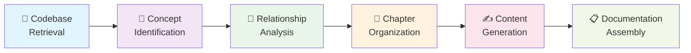

# 🎯 CodeStory: AI-Powered Documentation Builder

**Transform any codebase into a beginner-friendly tutorial in minutes**

[](https://python.org)

---

## 🌟 What is CodeStory?

CodeStory is an intelligent documentation generator that uses AI to analyze your codebase and automatically create comprehensive, beginner-friendly tutorials. It understands your project's architecture, identifies key concepts, and generates step-by-step learning materials that help newcomers navigate your code with confidence.

### ✨ Why CodeStory?

- **🧠 AI-Driven Analysis**: Leverages Google Gemini 2.0 to understand code relationships and architecture
- **📚 Beginner-Friendly**: Creates tutorials with analogies, examples, and clear explanations
- **🎨 Beautiful Output**: Generates markdown files with diagrams, code examples, and navigation
- **🔄 Multi-Language Support**: Works with any programming language and supports multiple output languages
- **⚡ Lightning Fast**: Processes entire codebases in minutes, not hours

---

## 🚀 Quick Start

### Installation

```bash
# Clone the repository
git clone https://github.com/your-username/CodeStory.git
cd CodeStory

# Install dependencies
pip install -r dependencies.txt

# Set up your AI API key
echo "GOOGLE_API_KEY=your_api_key_here" .env
```

### Generate Your First Tutorial

```bash
# For local projects
python codestory.py --local-path ./your-project

# For GitHub repositories  
python codestory.py --repo https://github.com/owner/repo
```

That's it! Your tutorial will be generated in the `output/` directory.

---

## 🏗️ How It Works

CodeStory follows a sophisticated 6-stage pipeline:



### 🔍 The Magic Behind the Scenes

1. **🔬 Smart Code Analysis**: Scans your entire codebase, respecting file patterns and size limits
2. **🎯 Concept Extraction**: AI identifies 5-10 core architectural concepts that matter most
3. **🕸️ Relationship Mapping**: Discovers how components interact and depend on each other
4. **📑 Optimal Sequencing**: Arranges concepts in the best learning order (simple → complex)
5. **📝 Content Creation**: Generates detailed chapters with examples, diagrams, and explanations
6. **🎨 Final Assembly**: Creates a polished tutorial with navigation and visual aids

---

## 🎨 Features & Capabilities

### 🌍 Multi-Language Support
- **Input**: Analyze codebases in any programming language
- **Output**: Generate tutorials in English, Spanish, French, German, and more
- **Smart Translation**: Maintains technical accuracy while adapting cultural context

### 🎯 Intelligent Content Generation
- **📊 Mermaid Diagrams**: Automatic flowcharts and architecture diagrams
- **🔍 Code Examples**: Relevant snippets with detailed explanations
- **🧭 Navigation**: Cross-references and chapter linking
- **📈 Progress Tracking**: Chapter count visibility throughout generation

### ⚙️ Flexible Configuration
- **📁 File Filtering**: Include/exclude patterns for precise control
- **📏 Size Limits**: Configurable file size thresholds
- **🎛️ AI Settings**: Caching, retry logic, and response tuning
- **📂 Output Customization**: Choose destination and naming conventions

---

## 📁 Project Structure

```
CodeStory/
├── 🚀 codestory.py                    # Simple command-line interface
├── 📖 tutorial_builder.py             # Main application logic
├── 🔧 pipeline_orchestrator.py        # Workflow coordination
├── 📝 documentation_processors.py     # Core AI processing nodes
├── 🤖 ai_interface/                   # AI communication module
│   └── model_connector.py             
├── 📁 file_operations/               # File system operations
│   ├── repository_scanner.py         
│   └── filesystem_explorer.py        
├── 📋 dependencies.txt               # Python requirements
├── 📚 documentation_guide.md         # Usage instructions
├── ⚙️ generate_docs.py               # Alternative entry point
└── 🔐 .env                          # API keys and configuration
```

---

## ⚡ Advanced Usage

### 🎛️ Command Line Options

```bash
# Basic usage
python codestory.py

# Specify local project
python codestory.py --local-path /path/to/project

# Analyze GitHub repository
python codestory.py --repo https://github.com/owner/repo --token your_token

# Custom output location
python codestory.py --output ./custom-docs

# Multiple language output
python codestory.py --language spanish --local-path ./project
```

### 🔧 Configuration File

Create a `config.yaml` for advanced settings:

```yaml
# Project settings
project_name: "MyAwesomeProject"
target_language: "english"
output_directory: "./documentation"

# File filtering
included_patterns: ["*.py", "*.js", "*.md"]
excluded_patterns: ["test_*", "*_test.py", "node_modules/**"]
max_file_size: 100000  # bytes

# AI settings
enable_caching: true
max_concepts: 8
gemini_model: "gemini-2.0-flash"

# GitHub settings
github_token: "your_token_here"
```

### 🎯 Programmatic Usage

```python
from tutorial_builder import DocumentationGenerator
from pipeline_orchestrator import DocumentationWorkflow

# Initialize the generator
generator = DocumentationGenerator()

# Configure workspace
config = {
    "local_filesystem_path": "./my-project",
    "target_language": "english",
    "maximum_concept_count": 6
}

# Generate documentation
workflow = DocumentationWorkflow(config)
result_path = workflow.execute()
print(f"Tutorial generated at: {result_path}")
```

---

## 🎯 Use Cases

### 👥 For Development Teams
- **📖 Onboarding**: Help new team members understand your codebase quickly
- **📋 Documentation**: Maintain up-to-date architectural documentation
- **🔄 Knowledge Transfer**: Preserve institutional knowledge when team members leave

### 🎓 For Educators
- **📚 Course Materials**: Create coding tutorials from real-world projects
- **💡 Examples**: Generate case studies for software architecture courses
- **🎨 Demonstrations**: Show best practices through documented code

### 🌟 For Open Source
- **🤝 Contributor Onboarding**: Lower the barrier for new contributors
- **📖 User Guides**: Help users understand how to extend your project
- **🚀 Project Promotion**: Showcase your architecture and design decisions

---

## 🔧 Configuration & Customization

### 🌍 Environment Variables

```bash
# Required
GOOGLE_API_KEY=your_gemini_api_key

# Optional
GITHUB_TOKEN=your_github_token
DEFAULT_OUTPUT_DIR=./output
LOG_LEVEL=INFO
CACHE_ENABLED=true
```

### 📊 Output Customization

The generated documentation includes:

- **📋 `index.md`**: Main tutorial overview with project summary and chapter index
- **📖 `01_concept_name.md`**: Individual chapter files with detailed explanations
- **🎨 Mermaid diagrams**: Visual representations of code relationships
- **🔗 Navigation links**: Seamless chapter-to-chapter flow
- **💡 Code examples**: Practical snippets with explanations

---

## 🤝 Contributing

We love contributions! Here's how you can help:

### 🐛 Found a Bug?
1. Check existing [issues](https://github.com/your-username/CodeStory/issues)
2. Create a detailed bug report
3. Include code examples and expected vs. actual behavior

### 💡 Have an Idea?
1. Open a [feature request](https://github.com/your-username/CodeStory/issues/new)
2. Describe your use case and proposed solution
3. We'll discuss and help you implement it!

### 🔧 Want to Code?
1. Fork the repository
2. Create a feature branch: `git checkout -b amazing-feature`
3. Make your changes and add tests
4. Submit a pull request with a clear description

---

## 📈 Roadmap

### 🎯 Coming Soon
- **🌐 Web Interface**: Browser-based tutorial generation
- **🔌 IDE Plugins**: VS Code and IntelliJ extensions
- **📱 Mobile Support**: Responsive documentation themes
- **🎨 Custom Templates**: Branded output styles

### 🚀 Future Vision
- **🧠 Advanced AI Models**: Support for Claude, GPT-4, and others
- **🔄 Live Updates**: Real-time documentation as code changes
- **👥 Collaborative Editing**: Team-based documentation workflows
- **📊 Analytics**: Track documentation usage and effectiveness

---

### 🆘 Need Help?
- **💬 Discussions**: Join our [GitHub Discussions](https://github.com/your-username/CodeStory/discussions)
- **🐛 Issues**: Report bugs or request features

### 🌟 Show Your Support
- ⭐ Star this repository if it helped you!
=

[⭐ Star](https://github.com/your-username/CodeStory) • [🐛 Report Bug](https://github.com/your-username/CodeStory/issues) • [💡 Request Feature](https://github.com/your-username/CodeStory/issues) • [📖 Documentation](documentation_guide.md)

</div>
